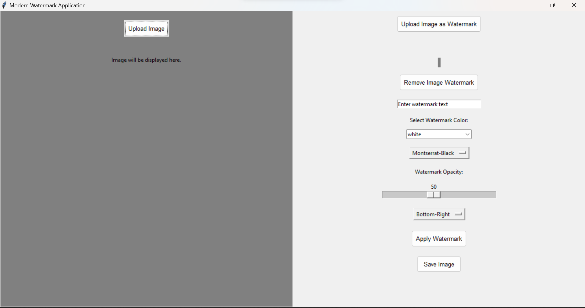

# Modern Image Watermark Application

The Modern Image Watermark Application is a user-friendly desktop tool that effortlessly adds customizable text or image watermarks to your photos.



## Installation

1. **Clone the repository:**
```bash
git clone https://github.com/MariosAvraam/image-watermark.git
```


2. **Navigate to the project directory and install the required packages:**
```bash
cd image-watermark
pip install -r requirements.txt
```


3. **Run the application:**
```bash
python main.py
```


## Features

- Upload images for watermarking.
- Add text or image-based watermarks.
- Customize the appearance and position of watermarks.
- Save the watermarked image.

## License
MIT

